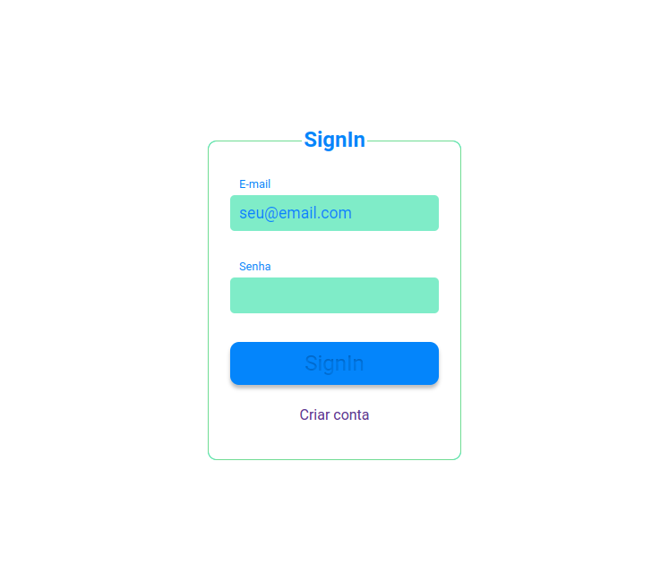
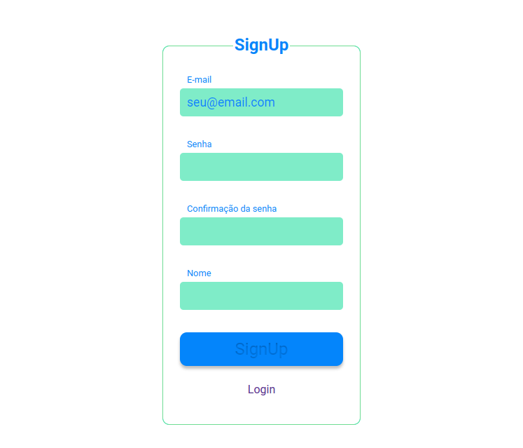
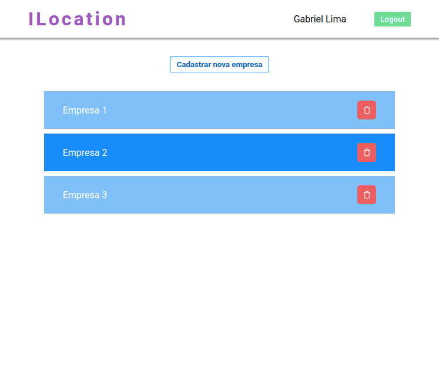
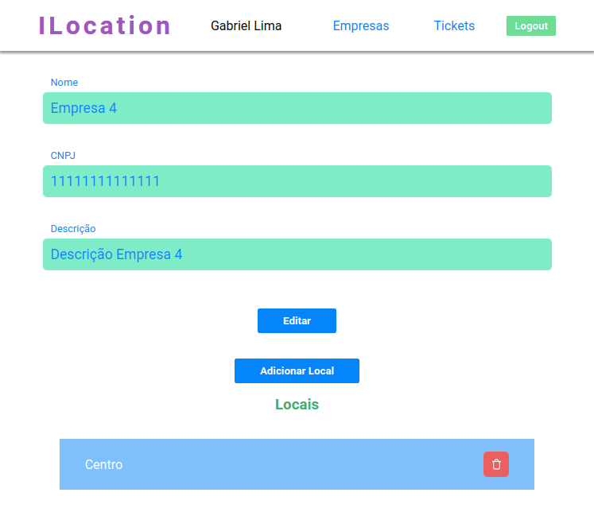
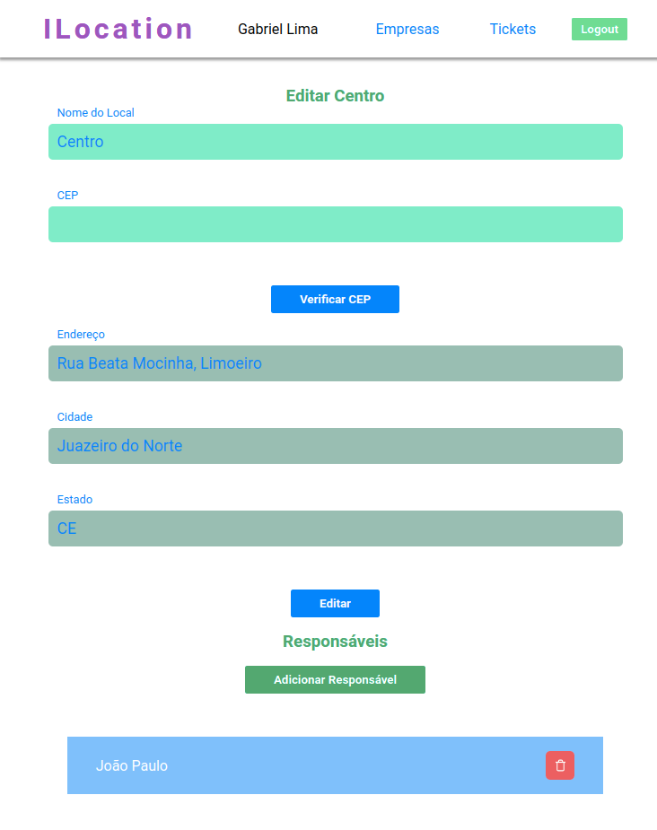

# Front End da Aplicação ILocation

## Tecnologias Usadas

- Nextjs
- Typescript
- React Hook Form
- React Modal
- Yup

## Descrição

FrontEnd para o sistema ILocation, que faz as chamadas para a API do [ILocation](https://github.com/gabriellima77/HubLocal_teste_back_end). Aplicação para cadastro de empresas e seus locais de atendimento.

## Imagens

### Login



### SignUp



### Empresas



### Editar Empresa



### Editar Local



### Editar Ticket


## Instalando e rodando a aplicação

- Instale as dependências:

```console
npm install
```

ou

```
yarn
```

- Para rodar a aplicação:

```console
npm run dev
```

ou

```
yarn dev
```

- Agora é só abrir abrir o [localhost](http://localhost:3000)

## Observação

Essa aplicação só irá funcionar corretamente se a API do ILocation estiver em execução na porta 3333 😄
